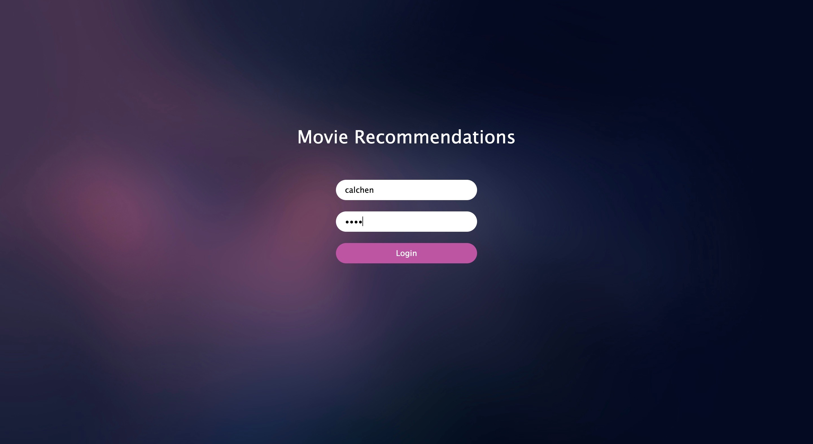
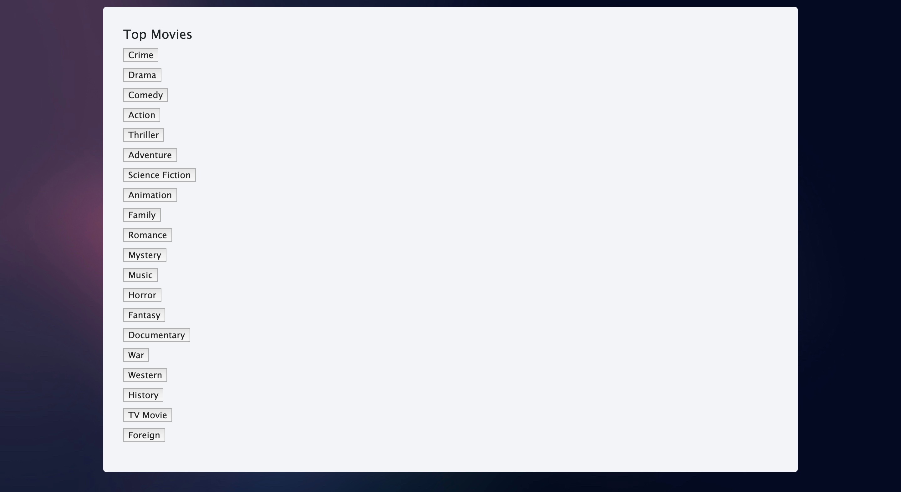
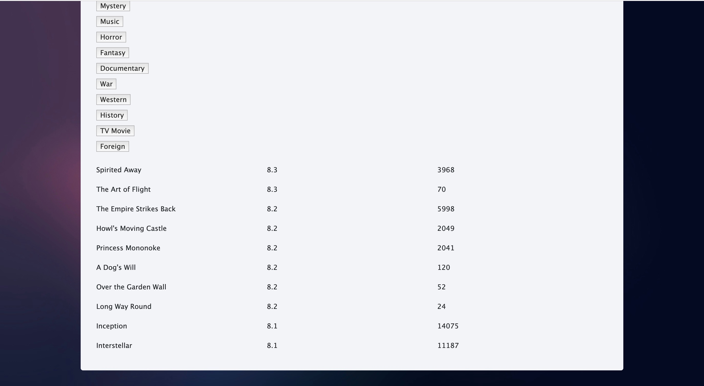
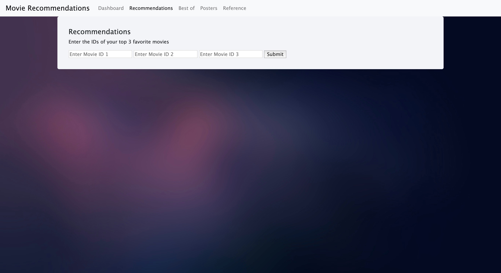
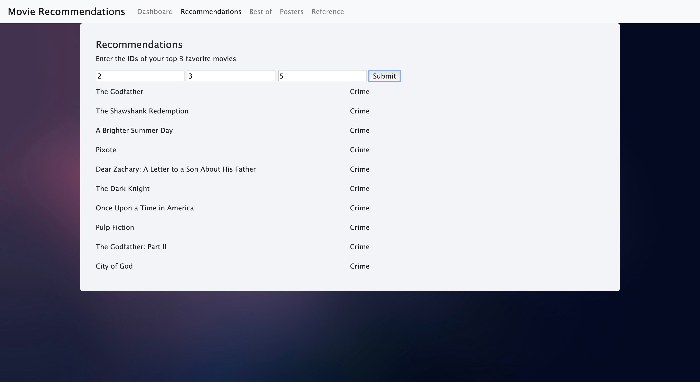
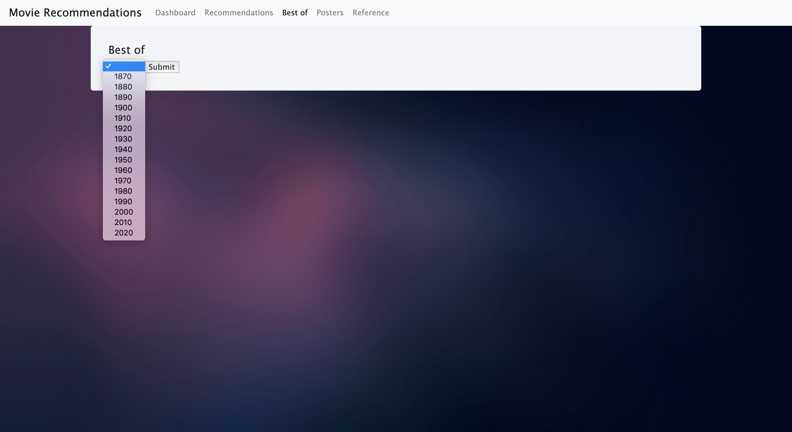
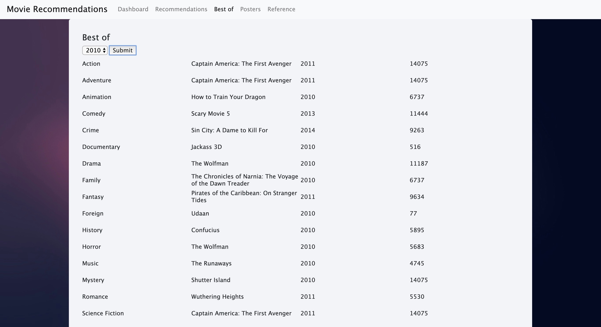
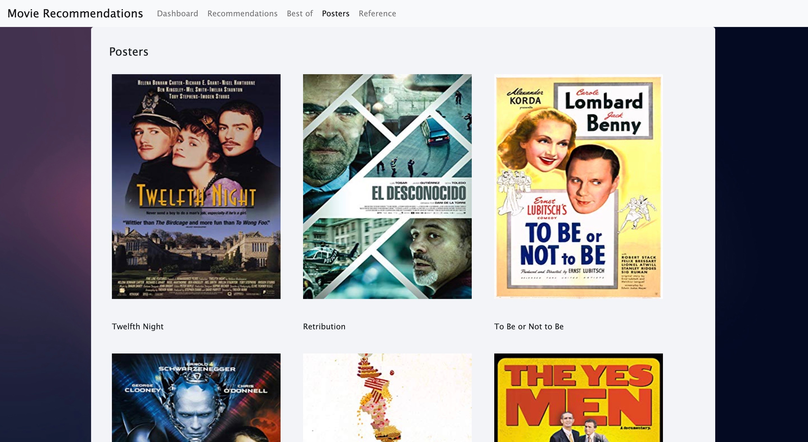

# MovieRecommendationWebApp

Please follow the below instruction to run this project.
- Extract the zip file (NodeApp.zip)
- Open a new terminal window
- Type the following commands
  1 - cd NodeApp
  2 - npm install
  3 - node app
The second command will install all the packages used in this project.
The third will run the server.
To check if the server is actually running, open a browser and go to the following link
http://localhost:8081

